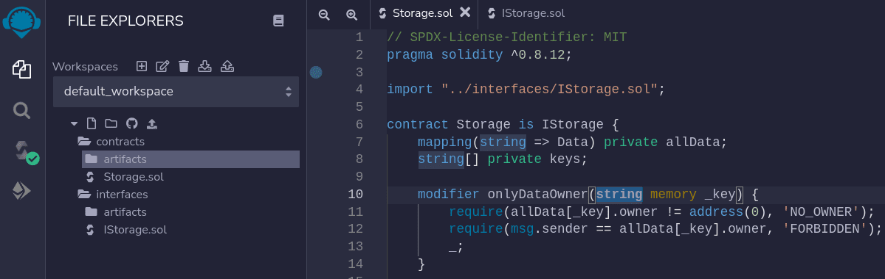
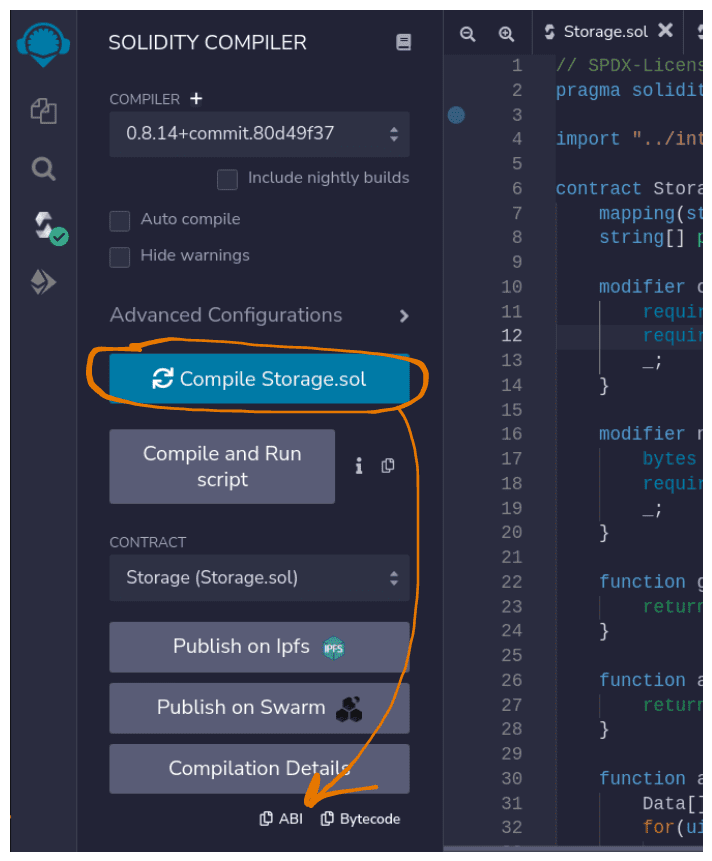
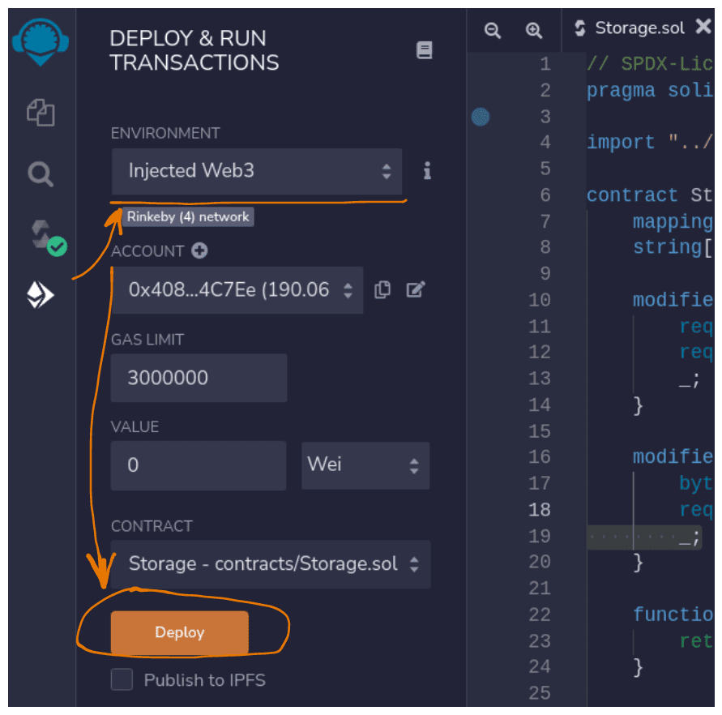

# Blockchain storage

Blockchain storage is a smart contract designed for data storage. In order to cut costs and facilitate operations, the data is stored in string form. These strings of data are modified outside smart contracts. The purpose of a smart contract is to save, modify, return and delete strings, while the contract user is responsible for the actual content. At the moment, we're using domain name to identify the data with the app to save, load, and modify the data as needed.

- [Storage contract source code](https://github.com/NotEternal/contracts/blob/main/contracts/Storage.sol)
- The primary deployed storage contract to be used is located on **Binance Smart Chain**: [Storage](https://bscscan.com/address/0xa7472f384339d37efe505a1a71619212495a973a#code=)

Feel free to apply any frontend libraries and frameworks you like, but only use a single storage contract if possible. This makes it easier to modify, transfer and control the data. Using multiple smart contracts over a number of networks and making individual changes presents a potential pitfall. It is essential to consider compatibility.
If individual changes are required (i.e. to enhance data storage or to add functionality), start by forking a contract, then make migrations for all the apps using the old contract.

## Saving and loading data in the app

General workflow is presented below:

```
      Frontend               Blockchain
┌──────────────────────┐ ┌──────────────────┐
│                      │ │                  │
│ App main interface ◄─┼─┼────────┐         │
│     │                │ │        │         │
│     │                │ │        │         │
│     │                │ │ Storage contract │
│     │                │ │        ▲         │
│     ▼                │ │        │         │
│ Admin panel ─────────┼─┼────────┘         │
│                      │ │                  │
└──────────────────────┘ └──────────────────┘
```

Note that each save (modify, delete) operation on blockchain storage causes a transaction refreshing the set of data associated with the smart contract. The data itself is stored on blockchain indefinitely. As a result:

1. Each such operation requires the owner to pay gas fee
2. Smart contract is responsible for extracting the correct version of the data from blockchain

### Admin panel example

> The examples are in [React](https://reactjs.org/) code. Less significant parts are simplified or left out.

Let us create a panel allowing admin to change app logo and work with blockchain storage.

1. Create functions for smart contract interaction in `utils.js`:

```js
import Web3 from "web3";
import { STORAGE_ADDRESS } from "./constants";
import { Storage } from "./contractBuilds";

const currentDomain = () => window.location.hostname || document.location.host;

const getStorage = (provider) => {
  const web3 = new Web3(provider);

  return web3.eth.Contract(Storage.abi, STORAGE_ADDRESS);
};

export const saveData = async ({ provider, owner, data }) => {
  const storage = getStorage(provider);

  return storage.methods.setKeyData(currentDomain(), {
    owner,
    info: JSON.stringify(data),
  });
};

export const fetchData = async (provider) => {
  const storage = getStorage(provider);
  const { info, owner } = await storage.methods.getData(currentDomain()).call();

  return { ...JSON.parse(info), admin: owner };
};
```

2. Create admin panel component `AdminPanel.jsx`:

```jsx
// ...
import { saveData } from "./utils";

export default function AdminPanel() {
  const { library, account } = useActiveWeb3React();
  const [logoUrl, setLogoUrl] = useState("");
  const onLogoUrl = (event) => setLogoUrl(event.target.value);

  const saveLogo = async () => {
    await saveData({
      provider: library.provider,
      owner: account,
      data: {
        logoUrl,
      },
    });
  };

  return (
    <div>
      <input value={logoUrl} onChange={onLogoUrl} placeholder="Logo URL" />
      <button onClick={saveLogo} disabled={!logoUrl}>
        Save
      </button>
    </div>
  );
}
```

3. A mouse click on `Save` button opens an external wallet, where the admin needs to confirm save transaction. Through this transaction we save a JSON string with parameter `logoUrl` to the smart contract. Now it's time to load the data with the app and make use of it. Add the following code to `App.jsx`:

```js
// ...
import { fetchData } from "./utils";

export default function App() {
  const { library, chainId } = useActiveWeb3React();
  const [data, setData] = useState(null);

  useEffect(() => {
    const fetch = async () => {
      const data = await fetchData(library.provider);

      setData(data);
    };

    fetch();
  }, [chainId, library]);

  return (
    <div>
      <header>
        
      </header>
      {/* ... */}
    </div>
  );
}
```

## Frequently asked questions

### Why do I have to use blockchain?

We are working with smart contracts stored and executed on blockchain. The apps we work on are also based on blockchain. While it is technically possible to extend the scheme with additional servers and backend logic, this would require additional time and resources. But what is the purpose?

### What is the difference between a common database and a smart contract?

Database software has a ready-made data processing interface, while a smart contract lacks data processing methods and schemes by default. It's our job to implement a smart contract manually to fit our requirements. The data structures we use are too complex to apply the types and methods built into [Solidity](https://docs.soliditylang.org/). This is why we store our data on blockchain in string form and modify it from the outside.

#### What are the advantages of blockchain storage?

- The data is stored on blockchain, in a decentralized structure.
- There's no need to develop and maintain server(s) hosting a database.
- The data is safe from unauthorized modification and deletion.
- The data is guaranteed to be accessible 24/7. Even though this is also possible with a centralized server, in a decentralized structure featuring multiple nodes (computers) the chances of failure are orders of magnitude lower.

#### What are the disadvantages of blockchain storage?

- The stored data is transparent and open for reading, even though it might not be human readable. It is therefore important to encrypt any private data.  
- The client bears direct expenses each time he completes a transaction and alters the blockchain state.

#### Why not use blockchain testnet?

Blockchain testnet does not hold value or inspire trust. There is a possibility (a very minor one for public networks) of blockchain wipeout, i.e. complete deletion of all data. As follows from its name, it is in a less stable state than the mainnet.

#### Why use this particular contract?

The smart contract we use is the optimal choice at the moment. It won't be a problem to switch to an alternative solution if needed.

### How is the data stored?

Take a look at the storage source code:

```js
struct Data {
    address owner;
    string info;
}

mapping(string => Data) private allData;
```

In the code above:

- `struct Data` is the type describing the data. Two members are defined within `Data`: `owner` holding the address of owner account with modification rights and `info` holding the actual string data.
- `(string => ...` is the string key allowing access to the data.
- `... => Data)` is the returned data value.

### How safe is storing data on blockchain?

Blockchain is a decentralized cryptographically protected system. The data is stored on multiple computers in a distributed manner. The only way to alter the data is to follow the established rules using the owner account (address).

### How do I use the smart contract directly?

There are three main methods of working with blockchain storage:

1. Saving data:

```js
function setKeyData(string memory _key, Data memory _data) external;
```

Pass the key string (app domain) as the first argument followed by the data wrapped into a `Data` object of form:

```js
{
    address owner;
    string info;
}
```

2. Getting data:

```js
function getData(string memory _key) external view returns(Data memory);
```

Pass the key string (app domain) to get a `Data` object containing owner address and the actual data.

3. Removing data:

```js
function clearKeyData(string memory _key) external;
```

Pass the key string (app domain) to clear data associated with the key.

Additional methods include:

```js
// get the keys for all saved Data objects
function allKeys() external view returns(string[] memory);
// get all saved Data objects
function allKeysData() external view returns(Data[] memory);
// save multpile Data objects at once
function setKeysData(KeyData[] memory _keysData) external;
// remove multpile Data objects at once
function clearKeysData(string[] memory _keys) external;
```

### How do I use a smart contract inside an app?

You could use one of the libraries allowing to interact with the EVM blockchain:

- [Web3.js](https://web3js.readthedocs.io/)
- [Ethers](https://docs.ethers.io/)

In order to use the storage, you need:

- One of the libraries above
- Contract address
- ABI ([Application Binary Interface](https://docs.soliditylang.org/en/develop/abi-spec.html)): a JSON interface allowing one to interact with a smart contract as a class instance with its properties, methods, etc.

1. Get the smart contract address on blockchain. Use the contract with **BSС**: [Storage](https://bscscan.com/address/0xa7472f384339d37efe505a1a71619212495a973a).
2. Get the compiled contract (JSON with ABI) [here](https://raw.githubusercontent.com/noxonsu/unifactory/main/src/contracts/build/Storage.json).
3. Use the collected data to create a new contract instance:

```js
import web3 from "web3";
import { Storage } from "./abis";
import { STORAGE_ADDRESS } from "./constants";
// if you need to alter data as well as request it,
// pass the provider from an external wallet
const web3 = new Web3("https://bsc-dataseed.binance.org");
const storage = new web3.eth.Contract(Storage.abi, STORAGE_ADDRESS);
```

4. Now you can use the contract. Note that your external wallet must be in the same network as the contract instance (in this example, BSC)

```js
storage.methods.setKeyData("example.com", {
  owner: "0x...",
  info: JSON.stringify({
    foo: 1,
    bar: 2,
    subObj: {
      foo: 3,
    },
  }),
});

storage.methods.getData("example.com");
// ...
```

If ABI is not available to the public, you may need to manually create it. Here is a list of recommended tools:

- [Remix IDE](https://remix.ethereum.org/): an IDE that works in a browser window. Applicable for small-scale projects with few contracts.
- [Truffle](https://trufflesuite.com/): a complex IDE for local development, deployment and testing of smart contracts.
- [Hardhat](https://hardhat.org/): a more modern and advanced IDE.

#### Remix

1. To begin, add the smart contract files in `File explorer` tab:



2. Compile and copy ABI in `Solidiy compiler` tab:



3. If you need to deploy the contract, open `Deploy & run transactions` tab, connect an external wallet, select the correct blockchain network and deploy:



### How do I work with data in my app?

Once you retrieve the data from the contract, it's up to you to decide on the best way to utilize it in your app. Take into account the applied libraries and frameworks. Here are some complete examples:

#### React context

#### Redux

#### MobX

### Do I have to make the admin panel in the same design as the main app?

Your main goal is to create a complete product in minimal time. Saving time on design and layout allows us to release equally functional product earlier. The decision to design an admin panel that complements the actual app should be made before development and with the following considerations:

- Requred time: if it will take ages to replicate the original design, there is no point in trying.
- Applied toolset: if the app is already using a design system, it might be faster to utilize it.
- Personal preference: understandably, you want to combine quality, accessibility and elegance in your product. It's better to make compromise and focus on the points above.

### Can I make a single admin panel for use in multiple apps?

Why not create a universal solution, such as [Bootstrap dashboard](https://themes.getbootstrap.com/product/hyper-responsive-admin-dashboard-template/)?

Pros:

- Allows to develop the main part once and reuse later.
- Multiple products can be updated simultaneously.

Cons:

- Hard to integrate into actual apps (We are yet to find a way. Perhaps, single-spa?)
- No differentiation between apps: all the options are in the same spot. This problem may be solved by differentiating on the app level.
- Admin panel design won't match app design unless we also develop visual themes.
